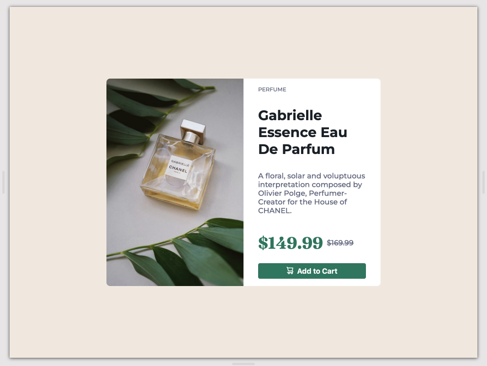

# Product-Preview-Card

This is a solution to the [Product Preview Card Challenge on Frontend Mentor](https://www.frontendmentor.io/challenges/product-preview-card-component-GO7UmttRfa).

## Screenshot




## The challenge

The challenge is to build out this product preview card component and get it looking as close to the design as possible. For this challenge I decided to use an OOP approach to create the card using a class with TypeScript.

### Links

- Solution URL: [solution](https://github.com/e-rojas/Product-Preview-Card)
- Live Site URL: [live site URL](https://e-rojas.github.io/Product-Preview-Card/)

## My process

For this challenge I wanted to work with the DOM with a different approach. I decided to use TypeScript and OOP to create the card. I created a class with the properties and methods that I needed to create the card. I used the DOM to create the elements and add the classes and attributes that I needed. I used the methods to add the event listeners and the logic to change the styles of the card.

### Built with

- Semantic HTML5 markup
- CSS custom properties
- Flexbox
- Mobile-first workflow

### What I learned

I learned how to use TypeScript and OOP to create a card. I learned how to use the DOM to create the elements and add the classes and attributes that I needed. I learned how to use the methods to add the event listeners and the logic to change the styles of the card.

```ts
// working with the constructor
 constructor(
    private brandType: string,
    private title: string,
    private description: string,
    private price: number,
    private discount: number
  ) {
    this.image = './images/image-product-mobile.jpg';

    this.hostElement = document.getElementById('app') as HTMLElement;
    this.cardElement = document.createElement('main') as HTMLElement;

    this.attach();
  }
```

- Website - [e-rojas](https://e-rojas.com/)
